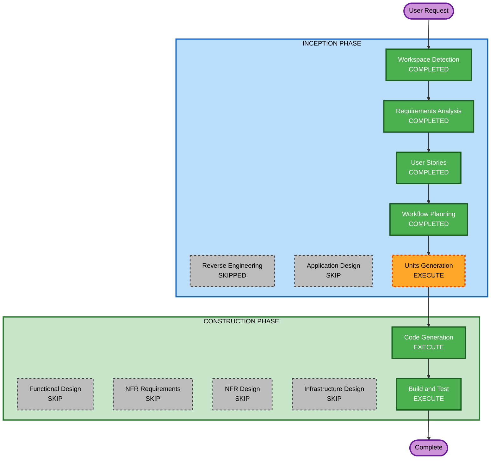

# Execution Plan

## Detailed Analysis Summary

### Transformation Scope

- **Transformation Type**: Single component enhancement (all changes within one .cpp file and config schema)
- **Primary Changes**: New multi-profile management system, replacement UI, sequential launch orchestration
- **Related Components**: None — this is a standalone single-binary application

### Change Impact Assessment

- **User-facing changes**: Yes — completely new default selection UI and launch flow
- **Structural changes**: No — still a single .cpp file, same build system
- **Data model changes**: Yes — config.json schema extended with profileGroup, slot, polPath, presets
- **API changes**: No — no external APIs
- **NFR impact**: Yes — credential security enforcement (Security Baseline extension)

### Risk Assessment

- **Risk Level**: Medium (multiple subsystems changing but isolated to one binary)
- **Rollback Complexity**: Easy (single exe, config is backward-compatible)
- **Testing Complexity**: Moderate (requires POL environment for full integration test, but UI/config logic testable standalone)

## Workflow Visualization



Text alternative:

```text
INCEPTION PHASE:
  [x] Workspace Detection (COMPLETED)
  [x] Reverse Engineering (SKIPPED)
  [x] Requirements Analysis (COMPLETED)
  [x] User Stories (COMPLETED)
  [x] Workflow Planning (COMPLETED)
  [ ] Application Design (SKIP)
  [ ] Units Generation (EXECUTE)

CONSTRUCTION PHASE:
  [ ] Functional Design (SKIP)
  [ ] NFR Requirements (SKIP)
  [ ] NFR Design (SKIP)
  [ ] Infrastructure Design (SKIP)
  [ ] Code Generation (EXECUTE — per-unit, 11 stories)
  [ ] Build and Test (EXECUTE)
```

## Phases to Execute

### INCEPTION PHASE

- [x] Workspace Detection (COMPLETED)
- [x] Reverse Engineering (SKIPPED — codebase small, already analyzed)
- [x] Requirements Analysis (COMPLETED)
- [x] User Stories (COMPLETED)
- [x] Workflow Planning (IN PROGRESS)
- [ ] Application Design — SKIP
  - **Rationale**: No new components or services. All changes happen within the existing single-file architecture. The user stories already define the structure clearly enough.
- [ ] Units Generation — EXECUTE
  - **Rationale**: The 11 stories need to be decomposed into concrete units of work with implementation sequence. Each story becomes a unit with clear boundaries and build-test checkpoints.

### CONSTRUCTION PHASE

- [ ] Functional Design — SKIP
  - **Rationale**: Business logic is straightforward (file copy, config read/write, menu display). Stories and requirements already define the logic clearly.
- [ ] NFR Requirements — SKIP
  - **Rationale**: NFRs are already defined in requirements.md and are simple (no logging, no cloud, no DB). Security rules enforced at code generation time.
- [ ] NFR Design — SKIP
  - **Rationale**: No NFR patterns to incorporate beyond what the Security Baseline extension already enforces during code generation.
- [ ] Infrastructure Design — SKIP
  - **Rationale**: No infrastructure. This is a standalone desktop binary.
- [ ] Code Generation — EXECUTE (per-unit, iterative)
  - **Rationale**: This is where the actual implementation happens. Each unit (story) gets a planning step then code generation, tested before moving to the next.
- [ ] Build and Test — EXECUTE
  - **Rationale**: Compile and manual verification after each unit.

### OPERATIONS PHASE

- [ ] Operations — PLACEHOLDER (not applicable for desktop tool)

## Execution Strategy

**Per-unit iterative approach:**

For each story (unit), the Construction phase executes as:

1. **Code Generation Planning** — define what code changes are needed
2. **Code Generation** — write the code
3. **Build** — compile with MSVC
4. **Test** — manual verification against acceptance criteria
5. **Checkpoint** — confirm working state before proceeding to next unit

This means we cycle through Code Generation → Build and Test for each of the 11 stories sequentially.

## Success Criteria

- **Primary Goal**: Replace batch-script-based multibox workflow with integrated autoPOL features
- **Key Deliverables**: Updated `FFXI-Launcher.cpp`, backward-compatible `config.json` schema
- **Quality Gates**: Each story compiles cleanly and passes its acceptance criteria before next story begins
- **Security Gate**: No credentials logged, no hardcoded secrets, file permissions set on config
